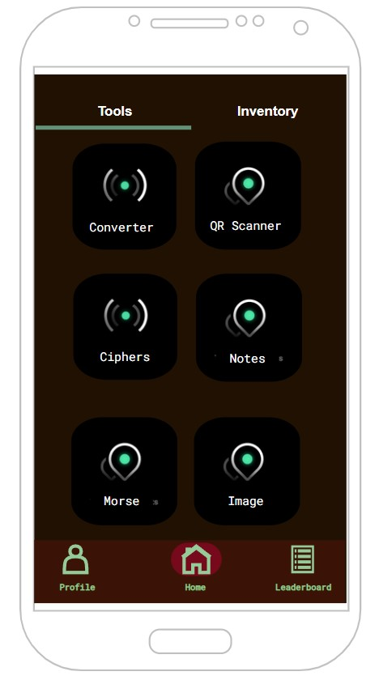

# Prototype-1

## Design

## Sources

 - [QR Scanner library](https://github.com/yuriy-budiyev/code-scanner)
   - [For accessing camera phone permissions](https://www.youtube.com/watch?v=drH63NpSWyk)
 
 - [TabLayout](https://androidgeek.co/how-to-use-tablayout-with-viewpager-in-kotlin-in-depth-guide-c831b018384e)
 - [Retrofit and Moshi API](https://www.youtube.com/watch?v=s1jqC70uO7Q&t=1136s)
 - [App Icon (Geometry icons created by Freepik - Flaticon)](https://www.flaticon.com/free-icons/geometry)
